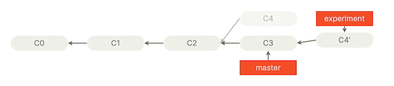

# Git Commit Visualizer

The purpose of this project (so far) is for me to be able to render git commits/branches similar to [git-scm.com](https://git-scm.com).

For instance here is an [image on the Git website](https://git-scm.com/book/en/v2/Git-Branching-Rebasing) that shows a visualization of rebasing a branch.

Here it is here for reference:


Here is the same representation in JSON format rendered by the project.


I added bounce to certain items if wanted (Ignore that the animation doesn't really loop seamlessly)




Currently, this is what is needed to render that:

```tsx
const gitHistory = [
  [undefined, undefined, undefined, {
    dimmed: true,
    id: 'C4',
    text: 'C4',
    arrowTo: ['C2']
  }, {
    id: 'experiment',
    text: 'experiment',
    arrowTo: ['C4\''],
    type: 'branch'
  }],
  [{
    id: 'C0',
    text: 'C0',
  }, {
    id: 'C1',
    text: 'C1',
    arrowTo: ['C0']
  }, {
    id: 'C2',
    text: 'C2',
    arrowTo: ['C1']
  }, {
    id: 'C3',
    text: 'C3',
    arrowTo: ['C2']
  }, {
    id: 'C4\'',
    text: 'C4\'',
    arrowTo: ['C3']
  }
  ], [
    undefined, undefined, undefined, {
      id: 'master',
      text: 'master',
      arrowTo: ['C3'],
      type: 'branch'
    }
  ]]
```
