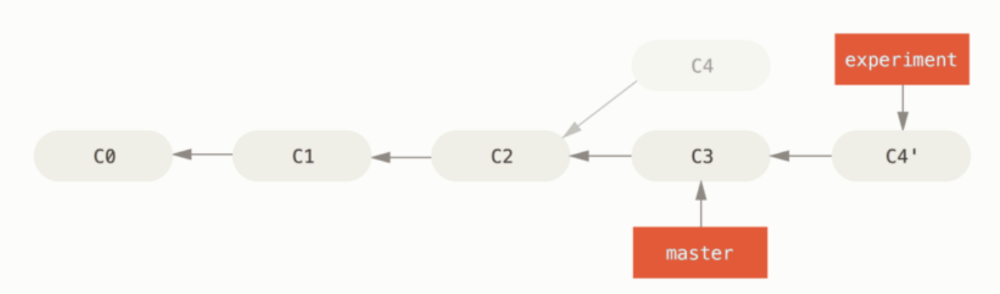
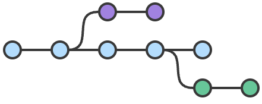

# Git History Generator

## Description

The purpose of this project (so far) is for me to be able to render git commits/branches similar to [git-scm.com](https://git-scm.com).

## Demo

https://git-history-generator.vercel.app/

## Comparison

### git-scm.com example

Here is an [image on the Git website](https://git-scm.com/book/en/v2/Git-Branching-Rebasing) that shows a visualization of rebasing a branch.

Here it is here for reference:

Here is the same representation in JSON format rendered by the project.

### Allows custom styling/components

Here is an image with custom components passed in as props to override the design.

### Atlassian Example

